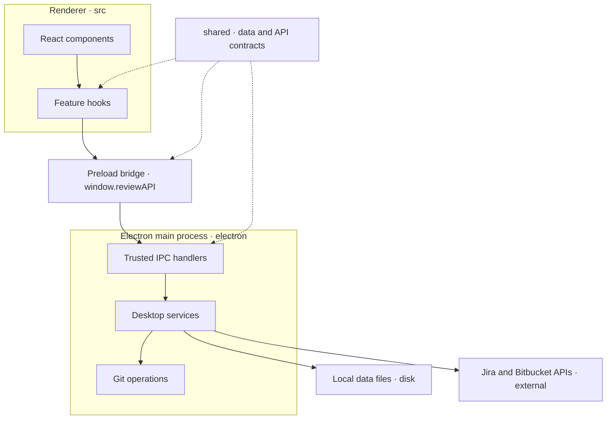
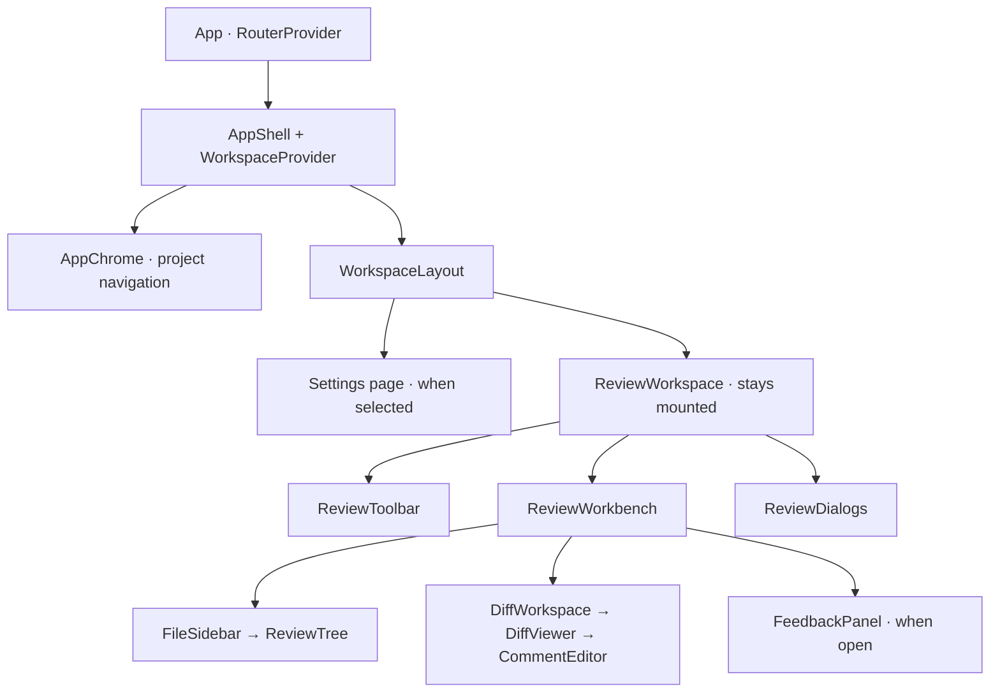
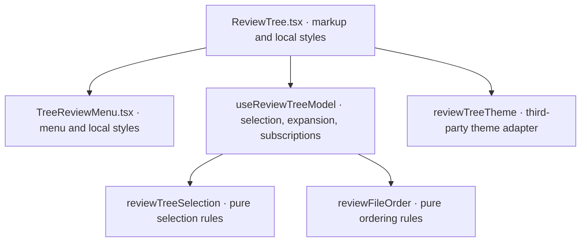
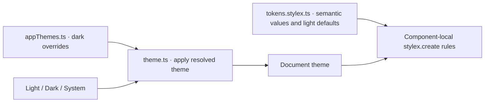
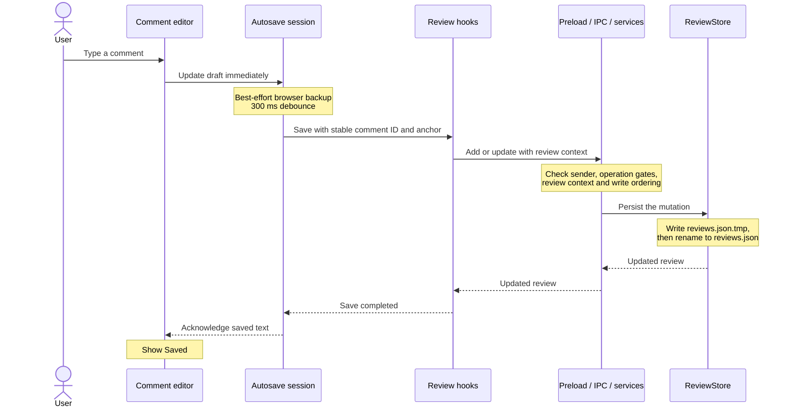
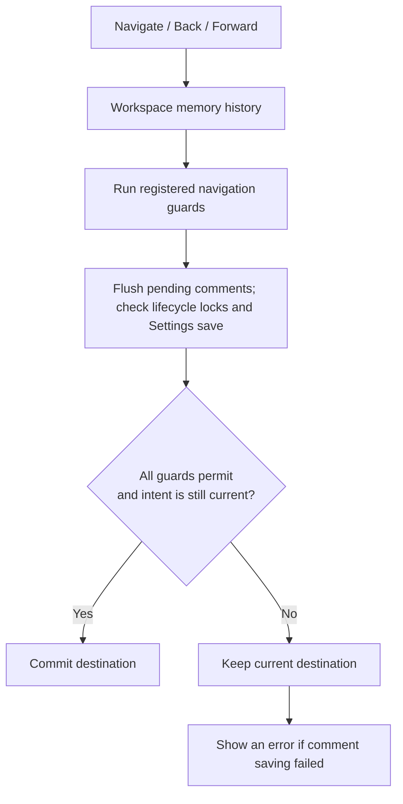

# A visual guide to Branchline

This guide describes the current implementation after the architecture refactor. Start with the first two diagrams for the overall shape, then follow a comment from the editor to disk. The [architecture reference](architecture.md) covers the ownership rules and verification commands.

## 1. What runs where?

There are two main runtime sides: React draws the interface in the renderer; Electron's main process handles native work. The preload exposes the small API that connects them. IPC means messages between these processes.

Solid arrows below follow a request. Dotted arrows show shared type definitions.



`shared` is code used by both sides, not another running process. For example, a review's shape and the arguments to `addComment` are defined once. The renderer requests operations through the bridge; the desktop services perform them.

**Read the code:** [preload](../electron/preload.ts), [API contract](../shared/api.ts), [IPC registration](../electron/ipc/register-review-handlers.ts), [service construction](../electron/application/create-services.ts).

## 2. How is the screen assembled?

The arrows here mean “renders inside.” Some small wrappers and optional panels are omitted so the main component relationships stay readable.



- **TanStack Router owns the destination:** selected project, current or saved review, and Settings section.
- **WorkspaceProvider holds shared workspace state:** projects, reviews, settings, and boot/integration state. Feature hooks coordinate operations on that state.
- **ReviewWorkspace composes the review experience:** its hooks handle review data, actions, display state, and dialogs.
- **ReviewWorkbench arranges the review panels:** each panel is a component with its own responsibility.

Opening Settings hides the review workspace while keeping it mounted. The diff editor and its comment session therefore survive the trip to Settings and back. Navigating to a different review or file can still change editor identity.

The router uses memory history: destinations change inside the app while Electron's trusted document URL stays the same.

**Read the code:** [router](../src/router.ts), [AppShell](../src/features/workspace/AppShell.tsx), [WorkspaceLayout](../src/features/workspace/WorkspaceLayout.tsx), [ReviewWorkspace](../src/features/reviews/workspace/ReviewWorkspace.tsx), [ReviewWorkbench](../src/features/reviews/workspace/ReviewWorkbench.tsx).

## 3. What belongs in a component, hook, or helper?

The file tree is a concrete example. Arrows mean “uses.”



| Kind | What it owns | Example |
| --- | --- | --- |
| Component | What is rendered, accessibility, local StyleX rules | `ReviewTree.tsx` |
| Hook | State, subscriptions, async sequencing, cleanup | `useReviewTreeModel.ts` |
| Pure helper | A calculation or rule without React state or side effects | `reviewTreeSelection.ts` |
| Desktop service | Native operations, persistence, provider coordination | `ReviewService` |
| Shared contract | Data shapes and request/response types | `ReviewAPI` |

This gives each kind of change a home. Changing how a tree row looks belongs with the component. Changing how a selection range is calculated belongs in the selection helper.

### How StyleX fits

Shared values live in the theme; each component defines how it uses them. Arrows below describe how theme values reach component styling.



For example, a panel uses `colors.panel` in its own styles. The theme supplies the light or dark value. Shared controls such as buttons and dialogs also own their styles, so feature components can reuse the whole control.

The native window and third-party tree/diff widgets have their own theme adapters because they do not all consume ordinary component StyleX rules.

**Read the code:** [tree feature](../src/features/reviews/tree), [semantic tokens](../src/theme/tokens.stylex.ts), [theme overrides](../src/theme/appThemes.ts), [theme application](../src/theme/theme.ts), [shared controls](../src/ui).

## 4. What happens when I type a comment?

This sequence follows a successful local save. The two sides of the IPC boundary are grouped to keep it readable.



The autosave session handles edits made while a save is in flight. Review hooks prevent an older refresh from overwriting newer feedback. If the branch or target context no longer matches, the desktop rejects the mutation rather than attaching it to another comparison.

“Saved” means the comment has been saved locally. Publishing feedback to Bitbucket is a separate explicit action. The browser backup is a recovery aid; it is not the acknowledgement that the JSON write completed.

**Read the code:** [comment editor](../src/features/reviews/diff/CommentEditor.tsx), [autosave](../src/features/reviews/diff/commentAutosave.ts), [review actions](../src/features/reviews/session/useReviewActions.ts), [review data](../src/features/reviews/session/useReviewData.ts), [review service](../electron/reviews/review-service.ts), [review store](../electron/reviews/review-store.ts).

## 5. Why doesn't navigation lose pending comments?

Normal navigation, Back, and Forward pass through the registered navigation guards. The checks are grouped here; the diagram does not prescribe the order in which guards are registered.



An update, window close, review retirement, or active Settings save can block navigation. After awaiting comment saves, the app rechecks lifecycle locks and whether a newer navigation attempt has replaced this one.

Internal redirects for startup, confirmed review retirement, and invalid destinations can deliberately bypass these guards. Closing the native window or installing an update has its own coordination: desktop gates and a matching renderer flush acknowledgement.

**Read the code:** [memory history](../src/navigation/createWorkspaceHistory.ts), [AppShell guards](../src/features/workspace/AppShell.tsx), [Settings guard](../src/features/settings/SettingsView.tsx), [desktop lifecycle](../electron/application).

## 6. Where should I look to change something?

This is a selected folder map, not a complete file listing.

```text
src/                          Interface
├── routes/                   Destinations and layouts
├── features/
│   ├── workspace/            Shared app state, chrome, navigation, lifecycle
│   ├── reviews/
│   │   ├── workspace/        Review screen composition and dialogs
│   │   ├── session/          Review data, actions, and display state
│   │   ├── diff/             Diff viewer, editors, autosave
│   │   └── tree/             File-tree display and interaction
│   ├── integrations/
│   │   ├── connections/      Account setup and connection settings
│   │   └── remote-review/    Publishing feedback and pull-request actions
│   ├── jira/
│   │   ├── browser/          Embedded Jira dialog and native-view session
│   │   └── tickets/          Ticket picker and searches
│   ├── projects/             Project UI
│   └── settings/             Settings UI
├── ui/                       Shared visual controls
├── lib/                      Shared renderer helpers
├── theme/                    StyleX variables and theme selection
└── jira-browser/             Separate Jira toolbar renderer

electron/                     Desktop work
├── application/              Service construction and native lifecycle
├── ipc/                      Trusted message handlers
├── projects/                 Project storage and operations
├── reviews/                  Review storage and operations
├── git/                      Comparisons and Git commands
├── integrations/             Provider coordination, Jira, Bitbucket
└── updates/                  Download and installation

shared/                       Data, API contracts, platform-independent rules
```

| I want to change… | Start here |
| --- | --- |
| A button or dialog used across features | `src/ui` |
| One component's spacing or layout | That component's local StyleX rules |
| A shared color or dark-theme value | `src/theme` |
| A destination or navigation behavior | `src/routes`, `src/navigation`, `src/features/workspace` |
| How a review screen is arranged | `src/features/reviews/workspace` |
| Comment editing or autosave | `src/features/reviews/diff` |
| Review refreshes or mutation coordination | `src/features/reviews/session` |
| How review changes are validated and stored | `electron/reviews` |
| A Jira or Bitbucket operation | `electron/integrations` |
| A request that crosses renderer/desktop | `shared/api.ts`, preload, and the matching IPC handler |

The guiding question is: **which feature owns this behavior, and is this rendering, stateful coordination, a pure rule, or native work?** Start there, then follow the relevant request or component diagram.
